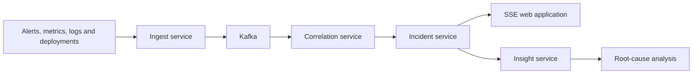

# Sentinel — Incident Intelligence & Reliability Platform

[](https://sentinel-incident-intelligence.vercel.app)
[](https://nextjs.org/)
[](https://openjdk.org/)
[](https://kafka.apache.org/)

**[Explore the live Sentinel showcase →](https://sentinel-incident-intelligence.vercel.app)**

> The hosted showcase uses synthetic browser-local data and requires no account, backend
> infrastructure, database, model API key or paid service.

Sentinel turns the raw noise emitted by a production system alerts, metrics, error logs and
deployment events—into a small number of incidents that a human can actually investigate.

A single failure in a payment service can trigger alerts across several services and teams. The
first part of an incident is often spent discovering that those alerts share one cause. Sentinel
correlates that evidence, maps the affected dependencies, identifies suspicious deployments and
presents responders with an explainable incident timeline and an advisory root-cause analysis.

## Why Sentinel is different

- **Correlation instead of aggregation:** signals are scored using time, topology, severity and
  shared labels rather than simply being placed in one dashboard.
- **Topology-aware reasoning:** Sentinel understands which services call one another and uses those
  relationships when grouping alerts and estimating impact.
- **Human-centred automation:** suspected deployments and AI-generated hypotheses are advisory.
  Sentinel puts evidence in front of responders without taking unsafe automatic action.
- **Explainable decisions:** correlation scores, timelines, affected services and evidence remain
  available for inspection after the incident.
- **Built for incident response:** role-based commands, escalation, live updates, MTTA, MTTR and
  service-level analytics are part of one workflow.
- **Safe portfolio demonstration:** the public deployment runs entirely on synthetic browser-local
  data, so visitors can explore it without credentials, infrastructure or model cost.
- **Responsive interface:** the application supports desktop, tablet and mobile layouts.

## Two ways to explore Sentinel

### Hosted portfolio showcase

The Vercel deployment is a responsive frontend-only demonstration built from the same pages and
components as the platform UI. It uses seeded browser-local data to demonstrate:

- incident filtering and investigation;
- severity, status and escalation workflows;
- service dependency topology;
- deployment correlation;
- incident timelines and operational evidence;
- reliability analytics; and
- curated root-cause analysis and postmortem output.

Visitor changes stay in that visitor's browser. The showcase does not connect to PostgreSQL, Redis,
Kafka or a model provider.

### Full distributed platform

The local Docker Compose environment runs the complete event-driven system: four Java services,
Kafka, PostgreSQL, Redis, OpenTelemetry, Prometheus, Grafana and the Next.js web application.



## Core capabilities

### Correlation

Two alerts belong to the same incident when they are close in the service dependency graph, close
in time, similar in severity and share relevant labels. Each factor is scored independently and
combined using configurable weights. The combined score is stored with the signal so a correlation
decision can be explained later.

### Service topology

The service graph is a first-class platform object. Correlation traverses the graph to determine
whether alerts from different services have a meaningful dependency path between them. The UI
shows callers, downstream dependencies and the incident-specific topology.

### Deduplication

Signal fingerprints are calculated from semantic content after volatile values such as pod names,
instance IDs and trace IDs are removed. UUIDs and changing numeric values in messages are
normalised, allowing repeated alerts from many replicas to collapse into one signal.

### Deployment correlation

Sentinel scores deployment suspicion using recency, graph proximity and deployment outcome. It
surfaces likely suspects with supporting rationale but deliberately does not perform an automatic
rollback.

### Escalation and incident commands

Incidents can be acknowledged, mitigated, resolved and escalated according to role and policy.
Timeline entries form an append-only record of important actions and state transitions.

### Advisory incident intelligence

The insight service assembles incident evidence and produces calibrated root-cause hypotheses,
confidence, reasoning and suggested next steps. The analysis is explicitly advisory and the
platform never acts on it automatically.

### Live browser updates

Incident changes reach the web application through Server-Sent Events. Kafka distributes updates
between service replicas, while SSE provides automatic browser reconnection using standard HTTP
semantics.

## Technology stack

| Area | Technologies |
| --- | --- |
| Web | Next.js 16 App Router, React, TypeScript, Tailwind CSS |
| Services | Java 21, Spring Boot, Spring Security, Spring Data JPA |
| Messaging | Apache Kafka |
| Persistence | PostgreSQL, Flyway |
| Caching and control | Redis |
| Live updates | Server-Sent Events |
| Observability | OpenTelemetry, Prometheus, Grafana |
| Local orchestration | Docker, Docker Compose, GNU Make |
| Infrastructure templates | Kubernetes, Kustomize, Terraform, AWS |
| Hosted showcase | Vercel |

## Quick start: full platform

### Prerequisites

- Docker Desktop, or Docker Engine with Compose v2;
- GNU Make;
- Python 3 for the scenario scripts; and
- at least 8 GB of memory available to Docker.

Java, Maven, Node.js, PostgreSQL, Redis and Kafka do not need to be installed on the host for the
containerised quick start.

```bash
git clone https://github.com/nikhilnani-ios/sentinel-incident-intelligence.git
cd sentinel-incident-intelligence

make doctor
make up
make seed
```

Wait until `docker compose ps` reports the required services as running or healthy, then open:

```text
http://localhost:3000
```

Sign in using the prefilled `sre@acme.io` account and select the `COMMANDER` role. The local
development API scopes the session to the `acme` demo tenant automatically.

`make seed` simulates a bad `payment-gateway` deployment and then degrades `checkout-api` and
`edge-gateway`. The expected outcome is one incident spanning the related services, with the
deployment linked as a likely suspect—not three unrelated pages.

`make storm` generates a larger set of flapping signals to demonstrate deduplication and rate
limiting.

| Surface | URL |
| --- | --- |
| Web application | http://localhost:3000 |
| Grafana | http://localhost:3001 |
| Prometheus | http://localhost:9090 |
| Ingest API | http://localhost:8081 |
| Incident API | http://localhost:8083 |

## Insight modes

No model API key is required for the default local demonstration.

| `INSIGHT_MODE` | Intended use | External cost |
| --- | --- | --- |
| `demo` | Public portfolio and local product demonstration | None |
| `stub` | Failure and empty-provider testing | None |
| `anthropic` | Private live-model evaluation | Usage-based |

In `demo` mode, Sentinel returns curated deterministic analysis through the context, parsing,
persistence and UI pipeline without making an external model request. The UI identifies this output
as demo analysis.

### Enable private live-model analysis

For private testing, create a local environment file and intentionally enable the provider mode:

```bash
cp .env.example .env
# Set INSIGHT_MODE=anthropic and ANTHROPIC_API_KEY in .env
docker compose up -d --build --force-recreate insight-service
docker compose ps insight-service
```

Never commit a populated `.env` file or provider credential. Return to `INSIGHT_MODE=demo` and
remove the key before publishing a portfolio deployment.

If analysis fails:

```bash
docker compose logs --tail=200 insight-service
curl -i http://localhost:8084/actuator/health
```

## Run the frontend showcase locally

```bash
cd web
cp .env.showcase.example .env.local
npm ci
npm run dev
```

Then open `http://localhost:3000`.

To deploy the showcase from this monorepo on Vercel:

1. Import the GitHub repository.
2. Set the project **Root Directory** to `web`.
3. Keep the detected Next.js build settings.
4. Add `NEXT_PUBLIC_SHOWCASE_MODE=true` to Production, Preview and Development.
5. Deploy without database, JWT or model-provider secrets.

## Service architecture

| Service | Port | Responsibility |
| --- | ---: | --- |
| `ingest-service` | 8081 | Validation, idempotency, rate limiting and Kafka publication |
| `correlation-service` | 8082 | Deduplication, topology-aware scoring, incident creation and deployment linking |
| `incident-service` | 8083 | Commands, queries, RBAC, SSE fan-out, escalation and analytics |
| `insight-service` | 8084 | Root-cause analysis and postmortem drafting |

Shared code lives in two library modules:

- `platform-common`: event contracts, Kafka configuration, security and error handling;
- `platform-domain`: entities, repositories and Flyway migrations.

### Why these boundaries

The services are separated by failure domain and scaling profile:

- **Ingest** handles the write-heavy external signal path and scales with incoming event volume.
- **Correlation** performs graph traversal and scoring, and scales with correlation workload.
- **Incident** handles request/response traffic and long-lived SSE connections, scaling with active
  users and incident operations.
- **Insight** is isolated so a model-provider failure degrades the analysis panel without preventing
  incident response.

## Deliberate engineering trade-offs

### Shared incident schema

Correlation and incident operations share one bounded context and database schema. Separating the
tables across databases would require distributed transactions or eventual consistency for records
that both services update within seconds.

### Publish after commit

Incident events are published after the database transaction commits. This keeps the implementation
direct, while accepting a small failure window between commit and publication. A transactional
outbox would be the appropriate evolution for a higher-stakes production environment.

### SSE instead of WebSockets

Traffic is server-to-client, making SSE a simpler fit with automatic browser reconnection and
ordinary HTTP proxy behavior.

### Polling escalation

Escalation uses a stateless database sweep rather than maintaining one in-memory timer per incident.
This survives restarts and avoids unbounded timer state.

### Tuned correlation rather than learned correlation

Correlation weights are configuration rather than a trained classifier. The system can explain
each score, and it does not assume the existence of a large labelled incident dataset.

## Reliability mechanics

- Kafka consumers use bounded retry and dead-letter handling.
- Producers use idempotent publication with acknowledgement from all required replicas.
- Redis claims suppress duplicate signal IDs within a configured window.
- Rate limiting uses an atomic Redis token-bucket operation.
- Incidents use optimistic locking, with stronger locking on race-prone correlation paths.
- The model-provider integration is protected by a circuit breaker.
- Analysis is content-hashed so unchanged evidence can reuse a stored result.

## Data model

`incident` is the aggregate root. Related records include:

- `incident_signal`: correlated signals and their scores;
- `timeline_entry`: append-only incident history;
- `incident_deployment`: deployment suspects and supporting rationale;
- `service_node`: catalogued services; and
- `service_dependency`: directed topology edges.

Database changes are versioned with Flyway, and the demo migration seeds a representative service
topology.

## Security

- Stateless JWT authentication with the role hierarchy
  `VIEWER → RESPONDER → COMMANDER → ADMIN`.
- Tenant-scoped repository queries prevent cross-tenant incident access.
- Protected records return a non-disclosing response rather than revealing their existence.
- Service containers are configured to run as non-root users.
- The local development token endpoint is limited to local/demo profiles.

### Authentication scope boundary

The local development web application stores its short-lived token in `sessionStorage`, so closing
the browser tab ends the session. A production deployment would replace the development token flow
with a real identity provider and an httpOnly, secure cookie.

The public Vercel showcase does not authenticate against the backend and does not expose production
credentials or infrastructure.

## Observability

Services export OpenTelemetry traces and Prometheus metrics. Provisioned Grafana dashboards cover:

- pipeline throughput, correlation outcomes, consumer lag, DLQ depth and analysis latency; and
- reliability outcomes such as MTTA, MTTR, escalations and incidents by severity.

The repository also includes alerting rules for monitoring Sentinel's own pipeline.

## Testing

```bash
make test
make test-web
```

The tests focus on behavior that is difficult or costly to get wrong:

- traversal of cyclic service graphs;
- topology-aware correlation and time decay;
- volatile-label stripping and fingerprint normalisation;
- escalation policy timing;
- malformed analysis output;
- replay suppression and failed-publication recovery; and
- frontend type checking and linting.

Build individual components directly with:

```bash
cd services && mvn verify
cd ../web && npm ci && npm run lint && npm run build
```

## Deployment assets

The repository includes infrastructure definitions for evolving the local platform into a
production deployment:

- `deploy/k8s`: Kustomize base and production overlay;
- `deploy/terraform`: AWS network, database, cache, Kafka and Kubernetes infrastructure; and
- `deploy/observability`: collector configuration, Prometheus rules and Grafana dashboards.

These assets represent the platform's production deployment design. Review and adapt environment,
security, scaling and cost parameters before using them outside a portfolio or development setting.

## Repository layout

```text
services/
  platform-common/       Event contracts, Kafka configuration, security and errors
  platform-domain/       Entities, repositories and Flyway migrations
  ingest-service/        Validation, idempotency and rate limiting
  correlation-service/   Graph traversal, scoring and incident creation
  incident-service/      Commands, queries, SSE, escalation and analytics
  insight-service/       Root-cause analysis and postmortems
web/                     Next.js 16 App Router, React, TypeScript and Tailwind CSS
deploy/
  k8s/                   Kustomize base and production overlay
  terraform/             AWS infrastructure definitions
  observability/         OpenTelemetry, Prometheus and Grafana configuration
scripts/simulate.py      Cascade and storm scenario generators
```

## Project status

Sentinel is a portfolio and engineering demonstration project. The hosted application uses
synthetic data; the complete distributed platform is intended for local development and architecture
exploration rather than production incident management without further security and operational
hardening.

## Feedback

Questions, feedback and architecture discussions are welcome. Open an issue in this repository or
connect with me through the profile linked to this GitHub account.

